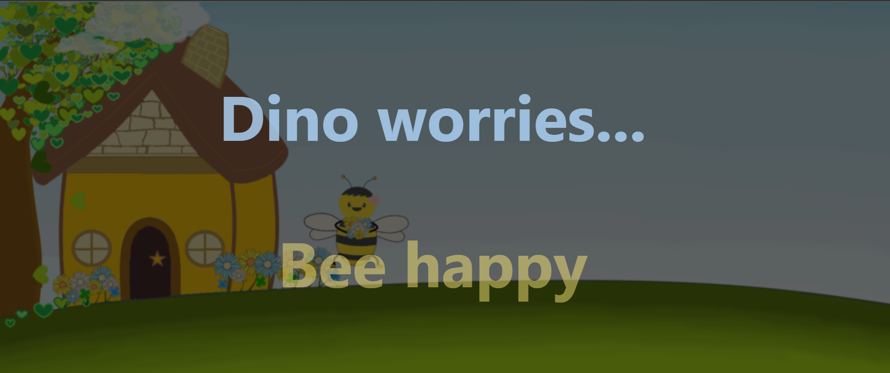
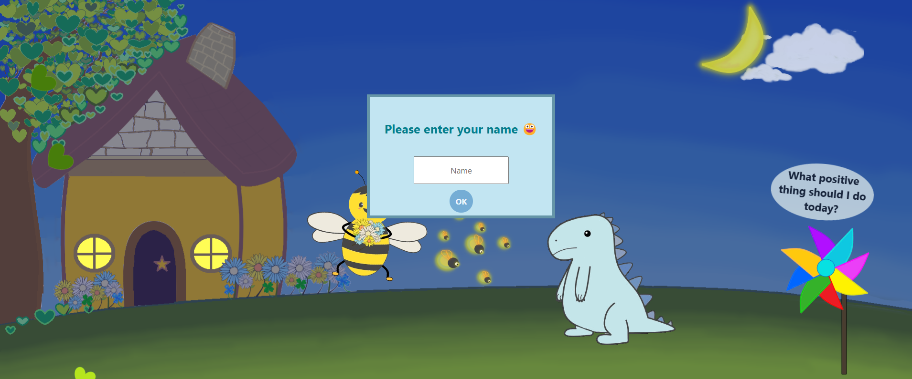
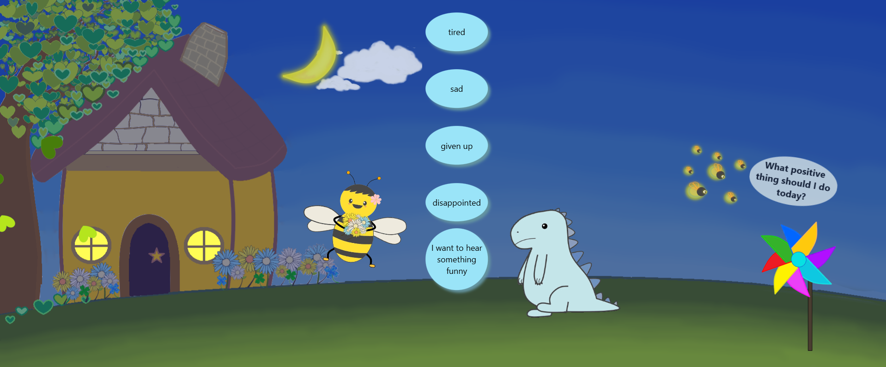
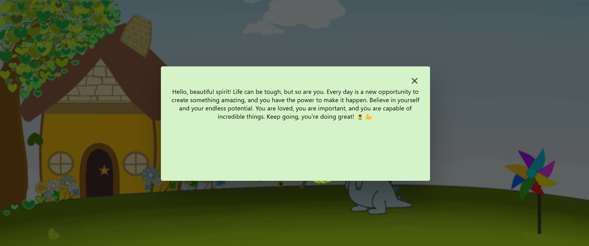

## 💚 Dino Worries: A Multilingual Web App for Positive Energy and Encouragement

[Dino worries, Bee happy](https://dinoworries.com/)

  

## This interactive web page delivers uplifting messages and encourages mental well-being, supporting multiple languages: English, Thai, and German. The app features an engaging interface with a Dino character and a bee, designed to inspire positivity and motivation.

⭐ Key Features:
Event Listeners: Utilizes click and animationend events to trigger interactive changes on the page.

DOM Manipulation: Dynamically shows and hides elements by using classList, style, and other DOM properties to create an engaging experience.

Responsive Design: Implements basic responsive behavior using matchMedia to adapt the layout across different screen sizes.

CSS Animations: Integrates CSS animations like fade-in effects and dynamic object movements to enhance the user experience.

Multi-language Support: Allows users to switch between English, Thai, and German using a floating language window.

Interactive User Experience: Includes animated elements like a dynamic Dino, a bee character, and a responsive name entry modal for a personalized touch.

  

  

Positive Affirmations: Provides a random positive message to uplift users, promoting mental health and motivation.

## 
  

🛠️ Technologies Used:
HTML5

CSS3 (for animations and layout)

## JavaScript (for DOM manipulation, event handling, and dynamic content)

🎯 This project showcases my early journey in web development, with a focus on language accessibility, interactive design, and beginner-level skills.
