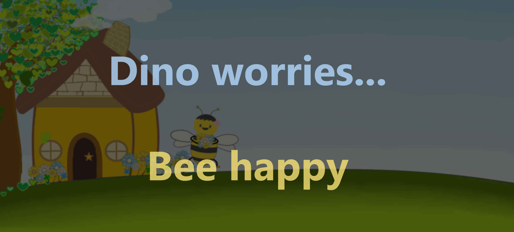
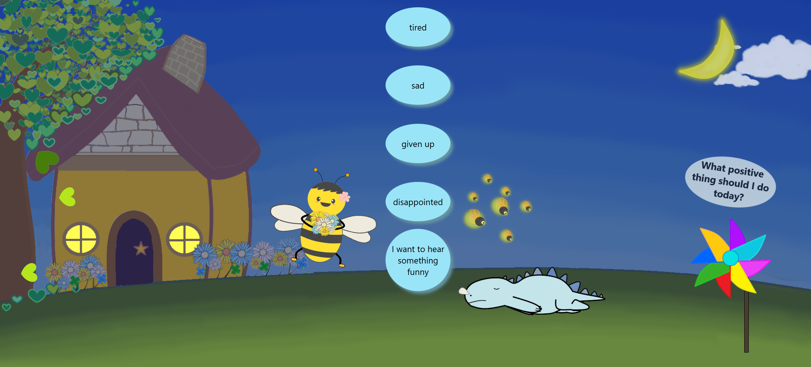
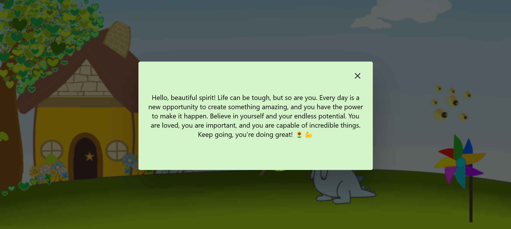

## 💚 Dino Worries: A Multilingual Web App for Positive Energy and Encouragement

  
 Live website 👉
  <a href="https://dinoworries.com/">Dino worries, Bee happy</a>

  

This interactive web page delivers uplifting messages and encourages mental well-being, supporting multiple languages: English, Thai, and German. The app features an engaging interface with a Dino character and a bee, designed to inspire positivity and motivation.

## ⭐ Key Features:

**Event Listeners:** Utilizes click and animationend events to trigger interactive changes on the page.

**DOM Manipulation:** Dynamically shows and hides elements by using classList, style, and other DOM properties to create an engaging experience.

**Responsive Design:** Implements basic responsive behavior using matchMedia to adapt the layout across different screen sizes.

**CSS Animations:** Integrates CSS animations like fade-in effects and dynamic object movements to enhance the user experience.

**Multi-language Support:** Allows users to switch between English, Thai, and German using a floating language window.

**Interactive User Experience:** Includes animated elements like a dynamic Dino, a bee character, and a responsive name entry modal for a personalized touch.

  

  

Positive Affirmations: Provides a random positive message to uplift users, promoting mental health and motivation.

  

## 🛠️ Technologies Used:

HTML5

JavaScript (for DOM manipulation, event handling, and dynamic content)

Created original visual assets with Photoscape and Paint

CSS for animations and interactive effects

## 🎯 Goal:

This project showcases my early journey in web development, with a focus on language accessibility, interactive design, and beginner-level skills.
